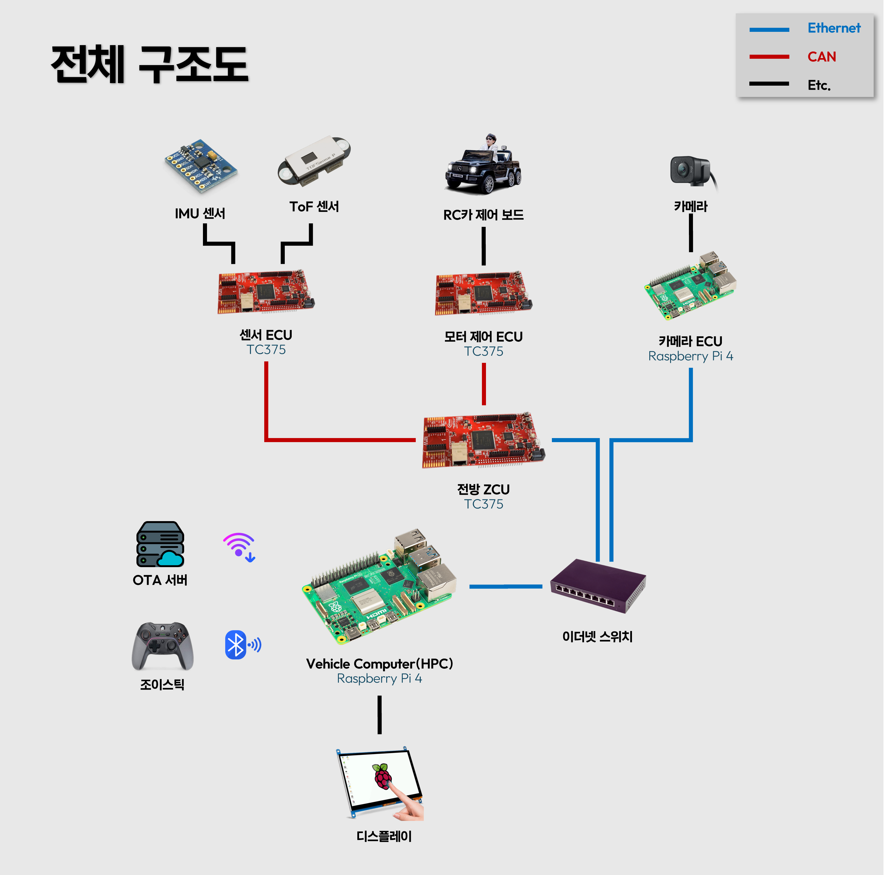

<div align="center">

# 스토어형 차량용 OTA 프로젝트 (Store-Type Vehicle OTA Project)

Vehicle Computer와 Front ZCU를 중심으로 SOME/IP 기반 Ethernet, CAN/CAN FD,  
DoIP/UDS OTA를 연동해 차량 기능 스토어와 LKAS, FVSA, AEB를 통합한 SDV 프로젝트

</div>

---

## 팀원

<div align="center">
<table>
  <tr>
    <td align="center">
      <a href="https://github.com/Wangjaepil">
        
        <br />
        <sub><b>왕재필</b></sub>
      </a>
      <br />
      팀장
      <br />
      CAN / CAN OTA / Sensor ECU / AEB
    </td>
    <td align="center">
      <a href="https://github.com/starryeev">
        
        <br />
        <sub><b>김건우</b></sub>
      </a>
      <br />
      팀원
      <br />
      SOME/IP / Gateway / Vehicle Computer
    </td>
    <td align="center">
      <a href="https://github.com/Kim-Byunghyun">
        
        <br />
        <sub><b>김병현</b></sub>
      </a>
      <br />
      팀원
      <br />
      Motor ECU / LKAS / FVSA
    </td>
    <td align="center">
      <a href="https://github.com/jaedong1">
        
        <br />
        <sub><b>김재동</b></sub>
      </a>
      <br />
      팀원
      <br />
      UDS / DoIP / Bootloader / SOTA
    </td>
    <td align="center">
      <a href="https://github.com/lsoyeon">
        
        <br />
        <sub><b>이소연</b></sub>
      </a>
      <br />
      팀원
      <br />
      UDS Client / CAN OTA / Vehicle Computer
    </td>
  </tr>
</table>
</div>

---

## 기술 스택

<div align="center">

### Hardware

<p>
  
</p>

### Core Stack

<p>
  
  
  
  
  
  
  
  
  
  
  
  
</p>

### Collaboration & Tools

<p>
  
  
  
  
  
  
  
</p>

</div>

---

## 1. 프로젝트 소개

`스토어형 차량용 OTA 프로젝트`는 차량 기능을 소프트웨어 상품처럼 선택하고,
필요한 기능과 펌웨어를 OTA로 업데이트할 수 있도록 설계한 스토어형 차량용 OTA
프로젝트입니다.

본 프로젝트는 SDV(Software Defined Vehicle) 환경에서 차량 기능이 하드웨어에
고정되지 않고 소프트웨어 업데이트를 통해 확장되는 흐름을 구현하는 데 초점을
두었습니다. Vehicle Computer는 사용자 대시보드와 기능 스토어를 제공하고,
Front ZCU는 Vehicle Computer와 하위 ECU 사이에서 Ethernet, SOME/IP, DoIP,
CAN, CAN FD 통신을 중계합니다.

사용자는 대시보드의 스토어에서 LKAS, AEB, FVSA와 같은 주행 보조 기능을
선택하고 활성화할 수 있습니다. 시스템은 기능 상태와 차량 상태를 UI에 표시하고,
필요한 경우 GitHub Releases 기반 OTA 패키지를 내려받아 대상 ECU에 전달합니다.

<table>
  <tr>
    <td>
      핵심 흐름은 <strong>기능 선택 → 기능 활성화 → 차량 제어 연동 → ECU 버전 확인 →
      OTA 업데이트 → 실패 시 복구</strong>입니다.
      <br /><br />
      이를 위해 차량 내부 통신은 SOME/IP 기반 Ethernet 통신과 CAN/CAN FD 통신을
      함께 사용하고, OTA 진단 흐름은 UDS/DoIP 및 Bootloader/SOTA 구조를 통해
      처리합니다.
    </td>
  </tr>
</table>

## 2. 프로젝트 목표

- 차량 기능 스토어에서 LKAS, AEB, FVSA 기능을 선택, 구매, 활성화할 수 있는 구조 구현
- OTA를 통해 차량 ECU 펌웨어를 원격으로 업데이트하고, 진행 상태와 결과를 대시보드에 표시
- SOME/IP 기반 Ethernet 통신과 CAN/CAN FD 통신을 통합한 차량 내부 네트워크 구성
- Joystick 기반 차량 제어와 사용자 편의/안전 기능을 실제 차량 제어 환경에 연결
- 기능 모듈화, 펌웨어 무결성 검증, 실패 복구를 포함한 안정적인 OTA 구조 설계
- V-Model 흐름에 따라 요구사항 정의, 설계, 구현, 단위/통합/시스템/인수 테스트 수행

## 3. 주요 기능

| 기능 | 내용 |
| --- | --- |
| **차량 통신 시스템** | Vehicle Computer, Front ZCU, 하위 ECU 간 실시간 데이터 교환을 위해 SOME/IP 기반 Ethernet 통신과 CAN/CAN FD 통신을 함께 사용합니다.<br />제어 신호, 센서 데이터, OTA 요청이 각 통신 계층을 통해 전달됩니다. |
| **차량 기능 스토어** | 대시보드 내부의 기능 스토어에서 사용자가 원하는 주행 보조 기능을 선택하고 활성화할 수 있습니다.<br />각 기능은 독립적인 소프트웨어 모듈로 관리되며, 활성화 상태는 Vehicle Computer에 저장됩니다. |
| **OTA 업데이트** | GitHub Releases에서 최신 펌웨어 패키지를 확인하고 다운로드합니다.<br />UDS의 DiagnosticSessionControl, RequestDownload, TransferData, RequestTransferExit, ECUReset 흐름을 이용해 ECU 업데이트를 수행합니다.<br />CRC 검증과 실패 시 기존 펌웨어 유지 구조를 고려합니다. |
| **LKAS** | Camera ECU에서 수집한 영상을 기반으로 차선을 인식하고, 차량 중심과 차선 중심의 차이를 계산해 조향 값을 산출합니다.<br />기어 상태, 속도 조건, 차선 검출 실패 여부를 고려해 기능 동작을 제한합니다. |
| **AEB** | ToF 거리 데이터와 차량 속도를 기반으로 전방 위험 상황을 판단합니다.<br />TTC(Time To Collision)와 안전 여유를 고려해 제동 필요 여부를 계산하고, 위험 상황에서 정지 명령을 생성합니다. |
| **FVSA** | 정차 중 전방 차량이 출발했는지 ToF 거리 변화로 판단합니다.<br />정차 시간과 거리 변화 조건이 충족되면 운전자에게 전방 차량 출발 알림을 제공합니다. |
| **차량 제어 및 대시보드 UI** | Joystick 기반으로 기어 P/D 전환, 속도, 조향 값을 입력하고 차량 제어 ECU로 전달합니다.<br />대시보드는 차량 속도, 네트워크 상태, 현재 시각, 날씨, OTA 상태, 기능 활성화 상태를 표시합니다. |

## 4. 시스템 소개

전체 시스템은 Vehicle Computer(HPC), Front ZCU, Sensor ECU, Motor ECU,
Camera ECU, OTA Bootloader, 그리고 기능 모듈(LKAS/AEB/FVSA)로 구성됩니다.

Vehicle Computer는 사용자와 시스템이 만나는 중심입니다. 웹 대시보드에서 기능
스토어를 제공하고, 기능 활성화 상태와 차량 상태를 표시하며, OTA Manager를 통해
최신 릴리즈 확인, 펌웨어 다운로드, 업데이트 진행 상태 표시를 담당합니다. 또한
SOME/IP 메시지를 통해 차량 제어 명령과 기능 이벤트를 Front ZCU로 전달합니다.

Front ZCU는 Ethernet-CAN Gateway이자 제어 판단 계층입니다. Vehicle Computer와는
Ethernet 기반 SOME/IP 및 DoIP/UDS로 통신하고, Sensor ECU 및 Motor ECU와는
CAN/CAN FD로 통신합니다. Front ZCU는 하위 ECU의 센서 데이터와 상태 정보를
Vehicle Computer로 올리고, Vehicle Computer의 제어/OTA 요청을 하위 ECU로
중계합니다.

Sensor ECU는 ToF 센서와 Hall Sensor를 통해 거리 및 속도 데이터를 수집합니다.
이 데이터는 Front ZCU의 AEB 판단과 FVSA 기능에 활용됩니다. OTA 상황에서는
CAN FD 기반 UDS 메시지를 통해 펌웨어 데이터를 수신하고, SOTA 및 Bootloader
구조를 이용해 안전한 펌웨어 전환을 수행합니다.

Motor ECU는 Vehicle Computer 또는 Front ZCU에서 생성된 차량 제어 명령을 실제
차량 제어 보드가 이해할 수 있는 UART Serial Packet으로 변환합니다. 이를 통해
조이스틱 입력, 주행/정지, 조향 제어가 실제 차량 동작으로 이어집니다.

Camera ECU는 실시간 영상 프레임을 Vehicle Computer로 전달하고, LKAS는 영상
전처리, 차선 마스크 생성, 차선 검출, 조향각 계산 순서로 동작합니다. FVSA와
AEB는 Sensor ECU의 거리/속도 데이터를 기반으로 운전자 편의와 안전 기능을
제공합니다.

<p align="center">
  
</p>

```text
Vehicle Computer / HPC
  |-- Dashboard UI / Feature Store
  |-- OTA Manager
  |-- UDS/DoIP Client
  |-- SOME/IP Vehicle Control
        |
        | Ethernet: SOME/IP, DoIP/UDS
        v
Front ZCU (TC375)
  |-- Ethernet-CAN Gateway
  |-- UDS/DoIP Server
  |-- CAN / CAN FD Gateway
  |-- AEB Decision Logic
        |
        | CAN / CAN FD
        v
Sensor ECU / Motor ECU / OTA Bootloader

Camera ECU
        |
        | Ethernet Video Stream
        v
Vehicle Computer / LKAS
```

## 5. 프로젝트 의의

이 프로젝트는 차량 기능을 단순히 개별 펌웨어로 구현하는 데서 끝나지 않고,
스토어, 통신, OTA, Gateway, Bootloader, LKAS, FVSA, AEB를 하나의 SDV 서비스 흐름으로
연결했다는 점에 의미가 있습니다.

특히 Vehicle Computer에서 기능을 선택하고, Front ZCU를 통해 하위 ECU와
상호작용하며, GitHub Releases 기반 OTA와 UDS/DoIP 진단 흐름으로 펌웨어를
갱신하는 구조를 직접 구현했습니다. 이를 통해 Zonal Architecture 환경에서
소프트웨어 기능 배포와 차량 제어가 어떻게 결합될 수 있는지 검증했습니다.

또한 LKAS, AEB, FVSA 같은 기능을 독립 모듈로 구성해 기능별 활성화와 업데이트가
가능한 구조를 시도했습니다. 이는 향후 차량 기능을 앱처럼 배포하고 관리하는
방식으로 확장할 수 있는 기반이 됩니다.
