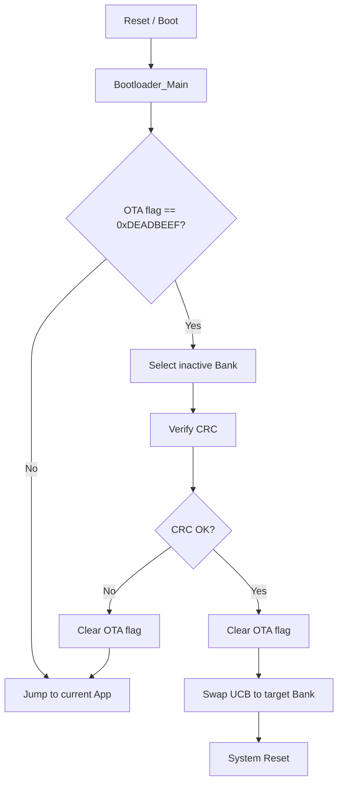

# Vehicle OTA Bootloader for AURIX TC375

TC375 Lite Kit 기반 차량 OTA 실습 프로젝트의 firmware bootloader입니다.  
Front ZCU와 Sensor ECU가 수신한 신규 firmware를 비활성 Flash Bank에 기록한 뒤, bootloader가 pending flag와 CRC를 확인하고 SOTA(Swap Over The Air) UCB 설정을 변경하여 다음 부팅 bank를 전환합니다.
firmware 수신은 상위 gateway 또는 Sensor ECU 쪽에서 담당하고, 이 bootloader는 이미 저장된 firmware image를 검증한 뒤 실행 bank를 전환하는 역할을 맡습니다.

## 주요 기능

- A/B Bank 기반 firmware update
- OTA pending flag 확인
- 신규 firmware CRC32 검증
- sparse image metadata 기반 CRC 검증
- 기존 metadata가 없을 경우 고정 sparse segment 기반 CRC 검증 경로 지원
- UCB_SWAP marker 변경을 통한 SOTA boot bank 전환
- UCB_SWAP ORIG/COPY 이중 기록 및 readback 검증
- CPU0/CPU1 application jump 동기화
- CRC 실패 시 기존 application으로 복귀
- UART 로그를 통한 bootloader 동작 상태 확인

## Target Environment

| 항목 | 내용 |
| --- | --- |
| MCU | Infineon AURIX TC37x / TC375 |
| Board | AURIX TC375 Lite Kit |
| Toolchain | AURIX Development Studio / TASKING TriCore |
| Base project | TC375 LK example project |
| Update target | PFlash Bank A / Bank B |
| Debug log | ASCLIN0 UART, 115200 bps |

## Memory Map

| 영역 | 주소 | 설명 |
| --- | --- | --- |
| Bootloader | `0x80000000 ~ 0x8001FFFF` | TASKING linker 기준 bootloader 128KB 영역 |
| Bank A App | `0x80020000 ~` | 기본 application 영역 |
| Bank B App | `0x80320000 ~` | OTA update 대상이 되는 alternate bank |
| OTA Flag | `0xAF000000` | DFlash pending flag 및 metadata 저장 영역 |
| OTA Magic | `0xDEADBEEF` | OTA update pending 상태 식별값 |
| UCB_SWAP ORIG | `0xAF402E00` | SOTA swap 설정 원본 영역 |
| UCB_SWAP COPY | `0xAF403E00` | SOTA swap 설정 copy 영역 |

## OTA Boot Flow



## 동작 방식

1. Bootloader가 DFlash의 `OTA_FLAG_ADDR`를 읽어 OTA pending 상태인지 확인합니다.
2. 현재 활성화된 SOTA group을 확인하여 다음 update target을 결정합니다.
   - 현재 Group A로 부팅 중이면 Bank B를 검증 대상으로 사용
   - 현재 Group B로 부팅 중이면 Bank A를 검증 대상으로 사용
3. DFlash에 저장된 metadata가 유효하면 metadata의 segment 정보를 기준으로 sparse CRC를 검증합니다.
4. metadata가 없으면 `fwSize`, `expectedCRC`와 코드에 정의된 고정 sparse segment 정보를 기준으로 CRC를 검증합니다.
5. CRC가 일치하면 OTA flag를 지우고 UCB_SWAP marker를 변경한 뒤 system reset을 수행합니다.
6. CRC가 실패하면 OTA flag를 지우고 기존 application으로 jump합니다.

## Multicore Boot Handoff

이 bootloader는 CPU0 중심으로 update 검증과 bank swap을 수행합니다.

- CPU0는 watchdog을 비활성화하고 UART를 초기화한 뒤 `SOTA_IsInitialized()`를 확인합니다.
- SOTA 설정이 없으면 `SOTA_InitialSetup()`으로 Group A marker를 기록하고 SWAPEN을 활성화한 뒤 reset합니다.
- CPU0가 application으로 넘어가기 직전에 `g_bootJumpToAppRequest`를 `1`로 설정합니다.
- CPU1은 이 flag를 기다리다가 application의 CPU1 startup entry인 `APP_START + 0x500`으로 jump합니다.
- CPU2는 현재 bootloader 단계에서 application handoff 대상이 아니며 idle loop에 머무릅니다.

## Sparse Metadata Layout

OTA metadata는 DFlash의 `OTA_FLAG_ADDR`부터 저장됩니다.

| Offset | Field | 설명 |
| --- | --- | --- |
| `+0x00` | `magic` | OTA pending magic, `0xDEADBEEF` |
| `+0x04` | `version` | metadata version |
| `+0x08` | `virtualSize` | CRC 계산 대상이 되는 virtual image 크기 |
| `+0x0C` | `gapFill` | sparse gap을 채울 값 |
| `+0x10` | `expectedCrc32` | 기대 CRC32 값 |
| `+0x14` | `segmentCount` | segment 개수 |
| `+0x20` | `segments[]` | offset, size, crc32 정보를 가진 segment metadata |

sparse image는 실제로 write된 segment만 Flash에서 읽고, segment 사이의 gap은 `gapFill` 값으로 CRC에 반영합니다.  
이를 통해 write되지 않은 PFlash gap 영역을 직접 읽을 때 발생할 수 있는 ECC/trap 문제를 피합니다.

metadata가 없는 구버전 layout에서는 `fwSize`와 `expectedCRC`를 사용하되, 실제 CRC 계산은 코드에 정의된 고정 segment 정보(`OTA_SPARSE_SEG1_*`, `OTA_SPARSE_SEG2_*`)를 기준으로 수행합니다. 따라서 이 fallback 경로도 일반적인 full binary CRC가 아니라 sparse-aware CRC입니다.

## Flash Programming

`ota_flash.c`는 PFlash erase/write를 직접 수행하기 위해 flash command 관련 함수를 PSPR 영역으로 복사해 실행합니다.

- `OTA_Flash_Erase()`는 PFlash sector size인 16KB 기준으로 erase 범위를 정렬합니다.
- PFlash 조작 중 CPU1, CPU2를 halt하여 다른 core의 Flash fetch/access를 방지합니다.
- erase는 `IfxFlash_eraseMultipleSectors()` 전체를 복사하지 않고 raw sector erase command wrapper로 처리합니다.
- write는 32-byte page 단위로 수행하며, 남는 바이트는 `0xFF`로 padding합니다.
- `OTA_Flash_Write()`의 `len`은 `uint16`이므로 firmware 전체를 한 번에 쓰는 API라기보다 chunk 단위 write API입니다.

## SOTA Swap Strategy

`sota_ucb.c`는 UCB_SWAP의 ORIG/COPY 영역을 모두 관리합니다.

- `SWAP_MARKER_A`는 Group A, `SWAP_MARKER_B`는 Group B를 의미합니다.
- swap entry는 최대 16개까지 append 방식으로 기록됩니다.
- 새 entry를 ORIG/COPY 양쪽에 기록하고 readback 검증한 뒤, 이전 entry의 confirmation 값을 `0xFFFFFFFF`로 바꿔 invalidate합니다.
- entry가 16개를 넘으면 COPY를 먼저 erase/rewrite/verify하고, 이후 ORIG를 erase/rewrite/verify합니다.
- ORIG와 COPY의 current entry index 또는 marker가 서로 다르면 fail-stop 처리합니다.
- `SCU_STMEM1.SWAP_CFG` 값이 Group A/B로 명확하지 않으면 잘못된 bank에 쓰는 것을 막기 위해 fail-stop 처리합니다.

## 주요 파일

| 파일 | 역할 |
| --- | --- |
| `Cpu0_Main.c` | CPU0 진입점, UART 초기화, SOTA 초기 설정, CPU1 App jump 동기화, CPU2 idle |
| `bootloader.c` | OTA pending flag 확인, CRC 검증, App jump, bank swap 결정 |
| `bootloader.h` | bootloader interface |
| `ota_flash.c` | PFlash erase/write, CRC32 검증, OTA flag 처리 |
| `ota_flash.h` | Flash address, bank address, OTA metadata 정의 |
| `sota_ucb.c` | UCB_SWAP 및 SWAPEN 설정, SOTA group 전환 |
| `sota_ucb.h` | UCB address, marker, SOTA interface 정의 |
| `UART_VCOM.c/h` | UART debug log 출력 |
| `Lcf_Tasking_Tricore_Tc.lsl` | TASKING linker script |
| `Cpu1_Main.c`, `Cpu2_Main.c` | 기존 예제 core main 코드가 주석 처리된 보조 파일 |

## Build & Flash

1. AURIX Development Studio에서 `firmware-ota-bootloader` 프로젝트를 import합니다.
2. TC375 Lite Kit에 맞는 TASKING TriCore build configuration을 선택합니다.
3. Bootloader project를 build합니다.
4. Debug configuration 또는 launch file을 이용해 TC375 board에 flashing합니다.
5. UART terminal을 연결하여 bootloader log를 확인합니다.

## Expected UART Log

OTA pending flag가 없을 경우:

```text
Bootloader Bank A!
[BL] Bootloader_Main enter
[BL] flag = ...
[BL] no pending flag, jump app
```

OTA update가 정상 검증될 경우:

```text
Bootloader Bank A!
[BL] Bootloader_Main enter
[BL] flag = 0xDEADBEEF
[BL] target = Bank B
[BL] metadata found
[BL][CRC] metadata sparse verify start
[BL][CRC] MATCH
[BL] CRC OK
[BL] flag clear OK
[BL] swap to B
```

CRC가 실패할 경우:

```text
[BL] CRC FAILED
[BL] flag clear after fail
```

## 주의사항

- UCB 영역은 부팅 설정과 직접 연결되어 있으므로 잘못된 값이 기록되면 board recovery가 필요할 수 있습니다.
- `SOTA_InitialSetup()` 또는 `SOTA_EnableSwapen()` 관련 코드는 board 상태를 확인한 뒤 신중하게 실행해야 합니다.
- Bank address와 linker script의 application 배치 주소가 반드시 일치해야 합니다.
- sparse metadata 또는 코드에 정의된 fallback segment offset/size는 실제 firmware manifest와 일치해야 합니다.
- PFlash erase/write 중에는 다른 core의 Flash access를 막기 위해 core halt 및 PSPR 실행 방식이 사용됩니다.
- `OTA_Flash_SetFlag()`는 legacy layout의 `magic`, `fwSize`, `expectedCRC`를 기록합니다. metadata 기반 OTA를 쓰는 경우 metadata writer 쪽 layout과 bootloader의 `OtaPendingMeta_t` 구조가 일치해야 합니다.
- CPU2 application handoff는 현재 구현되어 있지 않으므로, application이 CPU2 실행까지 필요하면 별도 startup handoff 설계가 필요합니다.

## Project Role

이 bootloader는 차량 OTA 저장/검증 시스템에서 MCU firmware update의 마지막 단계를 담당합니다.  
상위 OTA 서버와 Raspberry Pi 기반 gateway가 firmware를 전달하면, TC375 bootloader는 저장된 firmware의 무결성을 검증하고 안전하게 실행 bank를 전환합니다.
