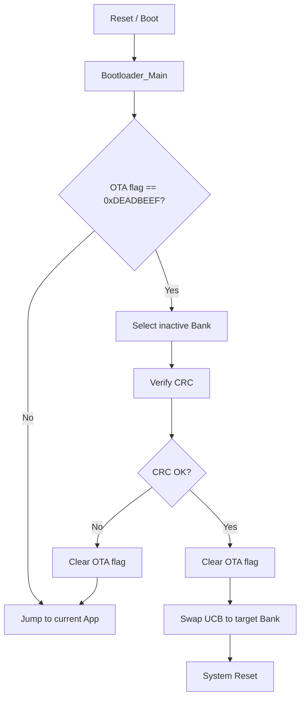

# Vehicle OTA Bootloader for AURIX TC375

스토어형 차량 OTA 프로젝트의 firmware bootloader입니다.  
Front ZCU와 Sensor ECU가 수신한 신규 firmware를 비활성 Flash Bank에 기록한 뒤, bootloader가 pending flag와 CRC를 확인하고 SOTA(Swap Over The Air) UCB 설정을 변경하여 다음 부팅 bank를 전환합니다.

## 주요 기능

- A/B Bank 기반 firmware update
- OTA pending flag 확인
- 신규 firmware CRC32 검증
- sparse image metadata 기반 CRC 검증
- 기존 metadata가 없을 경우 legacy CRC 검증 경로 지원
- UCB_SWAP marker 변경을 통한 SOTA boot bank 전환
- CRC 실패 시 기존 application으로 복귀
- UART 로그를 통한 bootloader 동작 상태 확인

## Target Environment

| 항목 | 내용 |
| --- | --- |
| MCU | Infineon AURIX TC37x / TC375 |
| Board | AURIX TC375 Lite Kit |
| Toolchain | AURIX Development Studio / TASKING TriCore |
| Network base | GETH + LwIP Ethernet example |
| Update target | PFlash Bank A / Bank B |
| Debug log | ASCLIN UART |

## Memory Map

| 영역 | 주소 | 설명 |
| --- | --- | --- |
| Bootloader | `0x80000000 ~ 0x8001FFFF` | bootloader 영역 |
| Bank A App | `0x80020000 ~` | 기본 application 영역 |
| Bank B App | `0x80320000 ~` | OTA update 대상이 되는 alternate bank |
| OTA Flag | `0xAF000000` | DFlash pending flag 및 metadata 저장 영역 |
| OTA Magic | `0xDEADBEEF` | OTA update pending 상태 식별값 |
| UCB_SWAP ORIG | `0xAF402E00` | SOTA swap 설정 원본 영역 |
| UCB_SWAP COPY | `0xAF403E00` | SOTA swap 설정 copy 영역 |

## OTA Boot Flow



## 동작 방식

1. Bootloader가 DFlash의 `OTA_FLAG_ADDR`를 읽어 OTA pending 상태인지 확인합니다.
2. 현재 활성화된 SOTA group을 확인하여 다음 update target을 결정합니다.
   - 현재 Group A로 부팅 중이면 Bank B를 검증 대상으로 사용
   - 현재 Group B로 부팅 중이면 Bank A를 검증 대상으로 사용
3. DFlash에 저장된 metadata가 유효하면 sparse CRC 방식으로 firmware를 검증합니다.
4. metadata가 없으면 `fwSize`, `expectedCRC` 기반 legacy CRC 검증 경로를 사용합니다.
5. CRC가 일치하면 OTA flag를 지우고 UCB_SWAP marker를 변경한 뒤 system reset을 수행합니다.
6. CRC가 실패하면 OTA flag를 지우고 기존 application으로 jump합니다.

## Sparse Metadata Layout

OTA metadata는 DFlash의 `OTA_FLAG_ADDR`부터 저장됩니다.

| Offset | Field | 설명 |
| --- | --- | --- |
| `+0x00` | `magic` | OTA pending magic, `0xDEADBEEF` |
| `+0x04` | `version` | metadata version |
| `+0x08` | `virtualSize` | CRC 계산 대상이 되는 virtual image 크기 |
| `+0x0C` | `gapFill` | sparse gap을 채울 값 |
| `+0x10` | `expectedCrc32` | 기대 CRC32 값 |
| `+0x14` | `segmentCount` | segment 개수 |
| `+0x20` | `segments[]` | offset, size, crc32 정보를 가진 segment metadata |

sparse image는 실제로 write된 segment만 Flash에서 읽고, segment 사이의 gap은 `gapFill` 값으로 CRC에 반영합니다.  
이를 통해 write되지 않은 PFlash gap 영역을 직접 읽을 때 발생할 수 있는 ECC/trap 문제를 피합니다.

## 주요 파일

| 파일 | 역할 |
| --- | --- |
| `Cpu0_Main.c` | CPU0 진입점 및 bootloader 실행 흐름 |
| `bootloader.c` | OTA pending flag 확인, CRC 검증, App jump, bank swap 결정 |
| `bootloader.h` | bootloader interface |
| `ota_flash.c` | PFlash erase/write, CRC32 검증, OTA flag 처리 |
| `ota_flash.h` | Flash address, bank address, OTA metadata 정의 |
| `sota_ucb.c` | UCB_SWAP 및 SWAPEN 설정, SOTA group 전환 |
| `sota_ucb.h` | UCB address, marker, SOTA interface 정의 |
| `UART_VCOM.c/h` | UART debug log 출력 |
| `Lcf_Tasking_Tricore_Tc.lsl` | TASKING linker script |

## Build & Flash

1. AURIX Development Studio에서 `firmware-ota-bootloader` 프로젝트를 import합니다.
2. TC375 Lite Kit에 맞는 TASKING TriCore build configuration을 선택합니다.
3. Bootloader project를 build합니다.
4. Debug configuration 또는 launch file을 이용해 TC375 board에 flashing합니다.
5. UART terminal을 연결하여 bootloader log를 확인합니다.

## Expected UART Log

OTA pending flag가 없을 경우:

```text
[BL] Bootloader_Main enter
[BL] flag = ...
[BL] no pending flag, jump app
```

OTA update가 정상 검증될 경우:

```text
[BL] Bootloader_Main enter
[BL] flag = 0xDEADBEEF
[BL] target = Bank B
[BL] metadata found
[BL][CRC] metadata sparse verify start
[BL][CRC] MATCH
[BL] CRC OK
[BL] flag clear OK
[BL] swap to B
```

CRC가 실패할 경우:

```text
[BL] CRC FAILED
[BL] flag clear after fail
```

## 주의사항

- UCB 영역은 부팅 설정과 직접 연결되어 있으므로 잘못된 값이 기록되면 board recovery가 필요할 수 있습니다.
- `SOTA_InitialSetup()` 또는 `SOTA_EnableSwapen()` 관련 코드는 board 상태를 확인한 뒤 신중하게 실행해야 합니다.
- Bank address와 linker script의 application 배치 주소가 반드시 일치해야 합니다.
- sparse metadata의 segment offset/size는 실제 firmware manifest와 일치해야 합니다.
- PFlash erase/write 중에는 다른 core의 Flash access를 막기 위해 core halt 및 PSPR 실행 방식이 사용됩니다.

## Project Role

이 bootloader는 차량 OTA 저장/검증 시스템에서 MCU firmware update의 마지막 단계를 담당합니다.  
상위 OTA 서버와 Raspberry Pi 기반 gateway가 firmware를 전달하면, TC375 bootloader는 저장된 firmware의 무결성을 검증하고 안전하게 실행 bank를 전환합니다.

