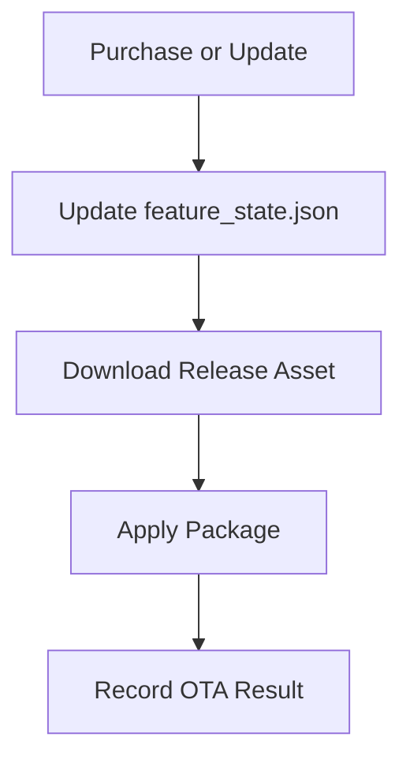

# Firmware Vehicle Computer

Vehicle Computer는 `vehicle-ota-store-system`에서 차량용 소프트웨어 스토어와 OTA 실행을 담당하는 Raspberry Pi/Vehicle Computer 런타임입니다. 웹 대시보드에서 기능을 구매/설치/활성화하고, GitHub Release 기반 기능 패키지 또는 ECU 펌웨어 패키지를 내려받아 차량 네트워크로 적용합니다.

이 모듈은 단순한 다운로드 프로그램이 아니라, 다음 역할을 함께 수행합니다.

- 차량 기능 스토어 상태 관리
- 다운로드형 Python 기능 모듈 적용
- Front ZCU 펌웨어 OTA
- Sensor ECU 펌웨어 OTA
- 조이스틱 기반 차량 제어 패킷 송신
- SOME/IP 기반 Ethernet 통신 유틸리티 제공
- 웹 프론트엔드 정적 파일 제공

## Directory Structure

| Path | Description |
| --- | --- |
| `main.py` | Vehicle Computer 런타임의 중심 파일입니다. 스토어 카탈로그, 기능 상태 저장소, OTA 매니저, 차량 제어 루프, 서비스 supervisor 설정을 담당합니다. |
| `ota.py` | 다운로드형 소프트웨어 패키지와 펌웨어 OTA를 처리합니다. GitHub Release asset 다운로드, sparse OTA 패키지 처리, DoIP/UDS 플래시, ZCU 경유 Sensor ECU OTA 로직이 포함되어 있습니다. |
| `vehicle_control.py` | 조이스틱 입력을 읽고 LKAS/FVSA/AEB 기능 런타임을 반영해 차량 제어 payload와 SOME/IP packet을 생성합니다. |
| `ethernet.py` | TCP/UDP 송신, payload 인코딩, SOME/IP packet build/parse 기능을 제공합니다. |
| `feature_state.json` | 구매 여부, 활성화 여부, 설치/업데이트 상태, OTA 적용 상태를 저장하는 로컬 상태 파일입니다. |
| `frontend/` | Vehicle Computer 웹 대시보드 정적 파일입니다. `index.html`, `store.html`을 포함합니다. |

## Main Features

### 1. Software Store Runtime

`main.py`의 `STORE_CATALOG`는 차량에 설치 가능한 기능 목록을 정의합니다.

| Feature | Type | Latest Version | Install Method |
| --- | --- | ---: | --- |
| `AEB` | Vehicle feature | `2.0.0` | Sensor ECU OTA + Front ZCU OTA |
| `FVSA` | Python feature package | `1.0.0` | GitHub Release에서 `FVSA.py` 다운로드 |
| `LKAS` | Python feature package | `1.3.0` | GitHub Release에서 `LKAS.py` 다운로드 |
| `LUFFY_THEME` | Theme | `1.0.0` | 다운로드 없는 테마 항목 |

`FeatureStateStore`는 기능별 구매 여부, 활성화 여부, 다운로드 여부, 적용 여부, pending OTA 상태를 `feature_state.json`에 저장합니다.

### 2. OTA Manager

`ota.py`의 `OtaManager`는 다운로드형 차량 소프트웨어를 처리하는 중간 계층입니다.

지원하는 OTA action은 다음과 같습니다.

| Action Type | Target | Description |
| --- | --- | --- |
| `github_release_file` | RPi / Vehicle Computer | GitHub Release asset에서 Python 기능 파일을 다운로드합니다. |
| `doip_uds_flash` | Front ZCU | ZCU sparse OTA package를 다운로드한 뒤 DoIP/UDS로 플래시합니다. |
| `doip_sensor_can_ota` | Sensor ECU | Sensor ECU sparse OTA package를 다운로드하고, ZCU DoIP gateway를 통해 Sensor ECU로 CAN OTA block을 전달합니다. |

Sensor ECU OTA는 Vehicle Computer가 Sensor ECU에 직접 CAN frame을 쓰는 구조가 아니라, ZCU의 DoIP gateway로 진단 메시지를 보내고 ZCU가 Sensor ECU OTA 전송을 중계하는 구조입니다.

### 3. Vehicle Control

`vehicle_control.py`는 조이스틱 입력과 다운로드된 기능 모듈을 결합해 실제 차량 제어 명령을 만듭니다.

- `JoystickReader`가 pygame joystick을 통해 P/D gear, speed axis, steer axis를 읽습니다.
- `LKAS.py`, `FVSA.py`, `AEB.py`는 다운로드된 기능 모듈로 동적으로 로드됩니다.
- 기능 런타임은 각각 `LKASFeature`, `FVSAFeature`, `AEBFeature` class를 기대합니다.
- 최종 제어값은 payload로 변환된 뒤 SOME/IP packet으로 만들어져 ZCU로 전송됩니다.

## OTA Flow



OTA 적용 방식은 기능 종류에 따라 달라집니다.

1. Python 기능 패키지는 GitHub Release asset에서 `.py` 파일을 다운로드해 `features/` 아래에 배치합니다.
2. Front ZCU 펌웨어는 sparse OTA package를 `firmware/` 아래에 다운로드하고 DoIP/UDS flashing을 수행합니다.
3. Sensor ECU 펌웨어는 sparse OTA package를 다운로드한 뒤 ZCU DoIP gateway를 통해 Sensor ECU로 전달합니다.
4. 모든 결과는 `feature_state.json`의 package, zcu_ota, firmware_payloads 상태에 기록됩니다.

## SOME/IP and Ethernet

`ethernet.py`는 Vehicle Computer와 ECU 사이의 Ethernet 통신을 위한 공통 유틸리티입니다.

- `send_ethernet_message()`로 TCP/UDP payload 송신
- `parse_payload()`로 text, hex, base64, json payload 변환
- `build_someip_packet()`으로 SOME/IP header + payload 생성
- `parse_someip_packet()`으로 수신 SOME/IP packet 해석

기본 SOME/IP packet은 다음 정보를 포함합니다.

| Field | Description |
| --- | --- |
| `service_id` | 서비스 식별자 |
| `method_id` | method/event 식별자 |
| `client_id` | 요청 client ID |
| `session_id` | 요청 session ID |
| `protocol_version` | SOME/IP protocol version |
| `interface_version` | service interface version |
| `message_type` | request/event 등 message type |
| `return_code` | 처리 결과 코드 |

## Default Network Configuration

환경 변수로 네트워크 설정을 바꿀 수 있습니다. 설정하지 않으면 코드의 기본값을 사용합니다.

| Environment Variable | Default | Description |
| --- | --- | --- |
| `VEHICLE_HOST` | `192.168.10.1` | Vehicle Computer dashboard/API host |
| `VEHICLE_PORT` | `8000` | Vehicle Computer dashboard/API port |
| `VEHICLE_TX_ENABLED` | `1` | ZCU로 차량 제어 packet을 송신할지 여부 |
| `VEHICLE_TX_PROTOCOL` | `udp` | 차량 제어 packet 송신 프로토콜 |
| `VEHICLE_TX_HOST` | `192.168.10.2` | 차량 제어 packet을 받을 ZCU IP |
| `VEHICLE_TX_PORT` | `30500` | 차량 제어 SOME/IP 수신 port |
| `VEHICLE_EVENT_HOST` | `0.0.0.0` | 차량 event 수신 bind host |
| `VEHICLE_EVENT_PORT` | `30500` | 차량 event 수신 port |
| `FRONT_ZCU_OTA_IP` | `192.168.10.2` | Front ZCU OTA 대상 IP |
| `FRONT_ZCU_OTA_PORT` | `13400` | Front ZCU DoIP port |
| `AEB_SENSOR_ECU_OTA_ZCU_IP` | `192.168.10.2` | Sensor ECU OTA를 중계할 ZCU IP |
| `AEB_SENSOR_ECU_OTA_DOIP_PORT` | `13401` | Sensor ECU OTA용 ZCU DoIP gateway port |

## Run

Python 3.10 이상 환경을 권장합니다. 코드에서 `Path | None`, `str | None` 같은 union type hint를 사용합니다.

```bash
cd src/firmware-vehicle-computer
python3 main.py
```

브라우저에서는 기본 설정 기준으로 다음 주소에서 대시보드에 접근합니다.

```text
http://192.168.10.1:8000
```

로컬 PC에서 테스트할 때는 host를 localhost로 바꿔 실행할 수 있습니다.

```bash
VEHICLE_HOST=127.0.0.1 VEHICLE_PORT=8000 python3 main.py
```

## Generated Runtime Directories

실행 중 다음 디렉터리와 파일이 사용됩니다.

| Path | Description |
| --- | --- |
| `features/` | GitHub Release에서 내려받은 Python 기능 모듈 저장 위치 |
| `firmware/` | ZCU/Sensor ECU OTA package 저장 위치 |
| `feature_state.json` | 스토어와 OTA 상태 저장 파일 |

## Notes

- 기본 네트워크 구성은 Vehicle Computer가 `192.168.10.1`, ZCU가 `192.168.10.2`인 환경을 기준으로 합니다.
- AEB는 단일 Python 기능만 설치하는 구조가 아니라, Sensor ECU와 Front ZCU 펌웨어 OTA까지 함께 관리하는 복합 기능입니다.
- Sensor ECU OTA는 ZCU가 중계하는 구조이므로 ZCU의 DoIP gateway와 Sensor ECU CAN OTA 구현이 함께 동작해야 합니다.
- `LKAS`, `FVSA`, `AEB` 기능 모듈은 각각 코드에서 기대하는 class name을 제공해야 런타임에 정상 로드됩니다.
- OTA 중에는 네트워크/flash 작업이 충돌하지 않도록 manager 내부 lock과 flashing state를 사용합니다.

## Repository Path

```text
src/firmware-vehicle-computer
```
